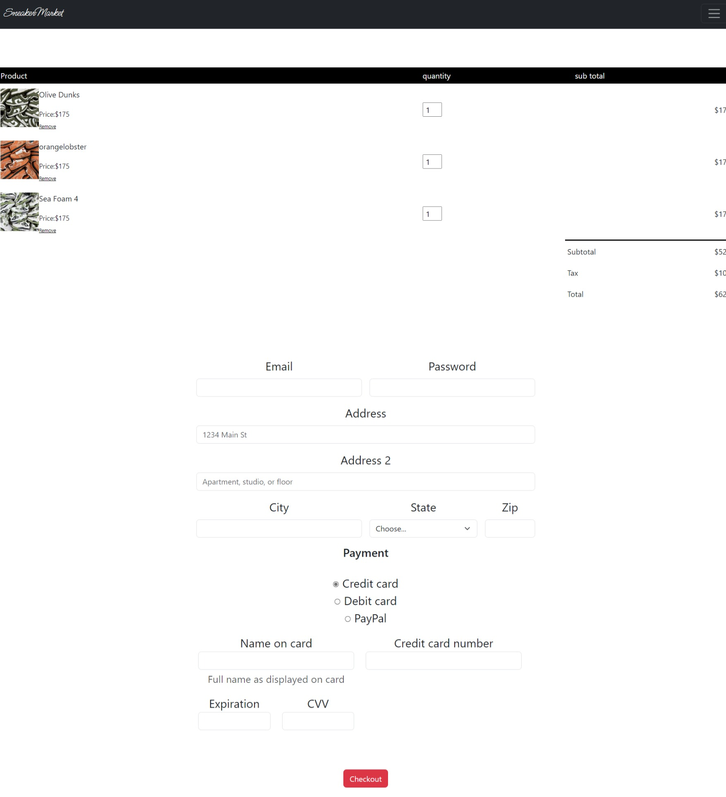

# capstone_project1
In this project I desinged a web page for a small buisness named " Sneaker Market ". It contains 5 html files for the different tabs on the nav bar. 

The first page in this nav bar is the home.html page: 
 

The second page is my signup sheet 

The third page is my log in 

The fourth page is my inventory 

The fifth page is my checkout 

One intresting piece of html/css i wrote was my table for my checkout tab 

